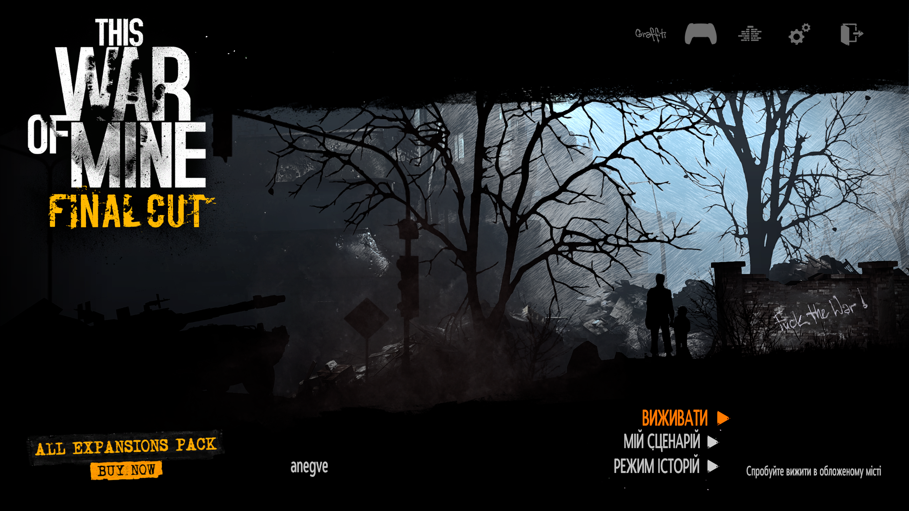
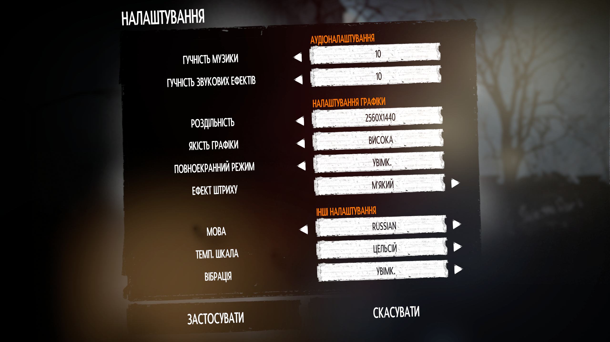
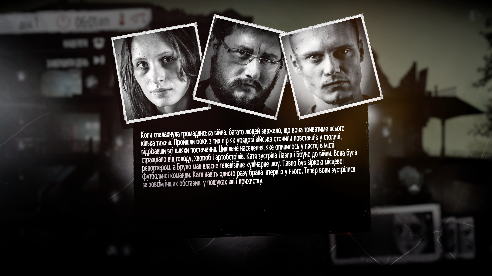

# This War of Mine: Final Cut — Українська локалізація 🇺🇦

Неофіційна українська локалізація гри **This War of Mine: Final Cut** для Xbox Game Pass / Microsoft Store (PC).

| | |
|---|---|
| **Платформа** | Xbox Game Pass / Microsoft Store (PC) |
| **Тип** | Текст (повна українізація) |
| **Покриття** | 100% — 12 508 текстових рядків |
| **Версія** | 1.0 |

## Скріншоти

| | |
|---|---|
|  |  |
|  |  |


## Встановлення

### Спосіб 1 — Автоматичний (рекомендовано)

1. [Завантажте архів](../../releases/latest) з останнього релізу
2. Розпакуйте архів
3. Запустіть `install.bat` від імені адміністратора
4. Інсталятор автоматично знайде папку гри
5. Оберіть `1` для встановлення
6. В грі оберіть мову: **Russian** (текст буде українською)

### Спосіб 2 — Ручний

1. Знайдіть папку гри (зазвичай `X:\XboxGames\This War of Mine- Final Cut\`)
2. Скопіюйте вміст папки `files` у папку гри із заміною:

```
files\Content\Resources\localizations.dat        → [GRA]\Content\Resources\
files\Content\Resources\localizations.idx        → [GRA]\Content\Resources\
files\Content\Resources\LocalizationBinFonts\*   → [GRA]\Content\Resources\LocalizationBinFonts\
```

3. В грі оберіть мову: **Russian**

> **Примітка:** Локалізація працює через підміну російської мови. В налаштуваннях гри потрібно обрати "Russian" — текст буде відображатися українською.

## Видалення

- **Через інсталятор:** запустіть `install.bat` і оберіть `2`
- **Вручну:** скопіюйте файли з папки `backup_original` назад
- **Або:** перевірте/відновіть файли гри через Xbox App

## Відомі обмеження

Гра використовує прекомпільовані текстурні атласи шрифтів (BinFont), які не містять українських гліфів. Для відображення українських символів ми додали записи з посиланнями на найближчі за виглядом існуючі гліфи:

| Символ | Відображається як | Примітка |
|--------|-------------------|----------|
| і / І | і / І | Коректно (латинські i / I) |
| ґ / Ґ | г / Г | Без гачка |
| ї / Ї | і / І | Без крапок |
| є / Є | с / С | Наближення |

## Технічні деталі

<details>
<summary>Що модифіковано</summary>

| Файл | Опис |
|------|------|
| `localizations.dat` | Замінено `russian.lang` на українські переклади (12 508 рядків) |
| `localizations.idx` | Оновлено індекс контейнера |
| `Font.ConfigBin` | Увімкнено і/ї/є/ґ у бітмапі доступності шрифтів |
| `_system.ttf.BinFont` | +8 українських гліфів (291 → 299) |
| `Designosaur-Regular.ttf.BinFont` | +8 українських гліфів (245 → 253) |
| `gnyrwn971.ttf.BinFont` | +5 українських гліфів (230 → 235) |

</details>

## Структура репозиторію

```
twom-final-cut-ua/
├── README.md                — цей файл
├── install.bat              — інсталятор / деінсталятор
└── files/                   — файли для копіювання в папку гри
    └── Content/Resources/
        ├── localizations.dat
        ├── localizations.idx
        └── LocalizationBinFonts/
            ├── Font.ConfigBin
            ├── _system.ttf.BinFont
            ├── Designosaur-Regular.ttf.BinFont
            └── gnyrwn971.ttf.BinFont
```

## Ліцензія

Цей переклад створено для некомерційного використання спільнотою.
Оригінальна гра належить [11 bit studios](https://www.11bitstudios.com/).
